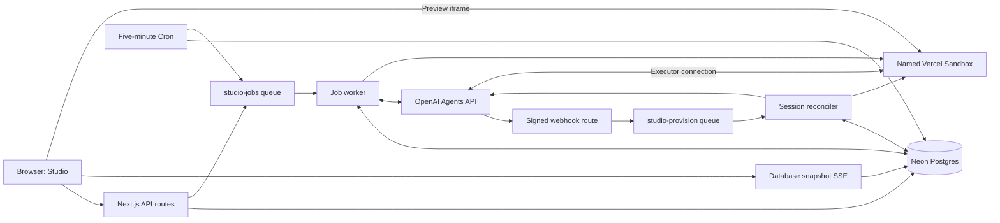

# Forma architecture

Forma is a single-user app builder with chat, saved projects, and live Next.js previews. This document describes the implementation in this checkout: Next.js 16.3.4, React 19.2.8, Node.js 24, OpenAI Agents API public beta through `openai` 7.15.0, Vercel Sandbox 3.2.1, Vercel Queues 0.5.1, and Neon Postgres. Package versions are recorded in `package.json` and `pnpm-lock.yaml`.

## System boundaries

The builder and the generated app are separate Next.js applications. The builder runs on Vercel; each generated app runs in its own named sandbox. Deploying the builder does not publish generated apps as Vercel deployments.

| Component | Responsibility and stored state |
| --- | --- |
| Next.js builder | UI, authentication, project APIs, SSE, webhook receiver, Queue consumers, and Cron route. Function memory is disposable. |
| Neon Postgres | Project ownership, sandbox/session identifiers, jobs and leases, chat, login throttling. The jobs table is also the durable outbox. |
| OpenAI | A saved agent configuration and a hosted session per project. Follow-ups use the same session. |
| Vercel Sandbox | Generated source, installed packages, executor, development server, and verification builds under `/workspace`. Files survive stop/resume through snapshots; processes are restarted. |
| Vercel Queues | Delivery of job IDs and session IDs to private consumers. Correctness depends on database state and idempotency, not a single delivery. |
| Browser | Current view, composer, and iframe. It observes persisted work and does not own its execution lifetime. |

There is no separate application backend service, Redis instance, Blob store, or Workflow DevKit integration. Background orchestration is implemented with Postgres, Queues, and Cron.

## Code map

| Path | Responsibility |
| --- | --- |
| `app/page.tsx`, `app/layout.tsx`, `app/globals.css` | Builder entry point, metadata, and styling. |
| `components/studio.tsx` | Sign-in, project picker, prompts, chat Markdown, activity, responsive preview, pause/resume. |
| `app/api/` | HTTP boundaries listed below. |
| `lib/projects.ts`, `lib/db.ts`, `db/schema.sql` | Parameterized queries, transactions, ownership, message persistence, and job coordination. The `pg` pool is reused per process with at most five connections. |
| `lib/worker.ts` | Job claiming, generation, validation, retries, and session reconciliation. |
| `lib/openai.ts`, `lib/webhook.ts` | Typed Agents SDK calls, pagination, and lifecycle-event selection. The SDK decodes OpenAI SSE. |
| `lib/sandbox.ts`, `lib/starter.ts` | Sandbox lifecycle, managed processes, network policy, and generated-app starter. |
| `lib/auth.ts`, `lib/http.ts`, `lib/job-route.ts`, `lib/config.ts` | Cookies, request checks, shared job routes, configuration. |
| `scripts/dev.ts`, `scripts/local-worker.ts` | Local Next.js process and database worker supervisor. |
| `scripts/create-agent.ts`, `scripts/migrate.ts` | Saved agent creation and repeatable schema setup. |
| `scripts/*smoke.ts`, `scripts/check-deployment.ts`, `tests/` | Live exercises, deployed checks, and automated tests. |
| `vercel.json`, `next.config.ts` | Queue triggers, Cron schedule, server package handling, and security headers. |

## Data model and invariants

| Table | Important fields and constraints |
| --- | --- |
| `projects` | UUID primary key; `owner_id`; prompt-derived name; unique `sandbox_name` (`studio-<project UUID>`); unique nullable `session_id`; `environment_id` and `environment_remote_url`; `preview_url`; status; `active_job_id`; activity and creation timestamps. Owner/update index supports the project picker. |
| `jobs` | UUID supplied as the request ID; project foreign key; kind (`edit`, `resume`, `stop`); prompt; phase; status; hosted turn ID; pre-submission timestamp and baseline root-turn ID; acknowledgement timestamp; lease token/deadline; latest error. A partial unique index allows only one pending/running job per project. |
| `messages` | Increasing ID; project and optional job foreign keys; role (`user`, `assistant`, `progress`, `error`); content; unique optional `event_key`; a final flag prevents completed assistant parts from regressing. Project/ID index supports ordered history. |
| `login_attempts` | Hashed request IP key, attempt count, and reset timestamp. |

`enqueueJob` locks the owned project with `SELECT ... FOR UPDATE`. A repeated request ID for that project returns the existing job. A different request while `active_job_id` is set returns 409. Creating the job, setting the active pointer/status, and saving its user message happen in one transaction. Project creation is a separate transaction and can leave a `new` project if subsequent enqueueing fails.

`finishJob` records completion or failure, clears the lease, and clears the project's active pointer only if it still references that job. The active pointer is application-managed, not a foreign key. Job kind is SQL-constrained; phase, status, and message role are text conventions rather than database enums.

Project states are `new`, `queued`, `starting`, `editing`, `ready`, `stopping`, `stopped`, and `error`. Job states are `pending`, `running`, `completed`, and `failed`; phases are `queued`, `streaming`, `checking`, and `done`. An edit can have a live preview before its independent build check passes.

The UI lists the latest 100 projects. History responses contain the latest 500 messages, returned in ascending order. Each saved message is truncated to 30,000 characters. Older rows remain in the database; the app has no deletion or history-pagination API.

## Prompt-to-preview workflow

1. The browser posts a prompt, project UUID, and request UUID to `/api/projects`. The server checks the origin, signed cookie, configuration, and input. It creates or retrieves the owned project, then commits its edit job.
2. `dispatchJob` publishes `{ jobId }` to `studio-jobs`. The request returns 202 even if publishing fails: the committed job remains available for recovery. The Queue idempotency key includes the job ID and current minute, allowing Cron to republish later.
3. `runJob` atomically claims a pending/running job whose lease is absent or expired. It writes a fresh lease token and a 15-minute deadline. A duplicate delivery with an active lease or a finished job does no work.
4. The worker prepares the persistent workspace. For a new project it uses `Sandbox.getOrCreate`; once a session exists it uses `Sandbox.get`, so missing saved storage is not silently replaced. Setup installs the Codex alpha executor if needed, writes starter files only if `package.json` is absent, and installs dependencies until `.studio-initialized` exists.
5. A first edit creates an OpenAI session referencing `OPENAI_AGENT_ID`, with `environment: { type: "self_hosted", workspace_directory: "/workspace" }`. Session creation uses `project-<UUID>` as the idempotency key and saves the returned session ID.
6. The worker fetches session state, saves `session.environment.id` and `remote_url`, and starts the executor using those exact connection details. It starts the preview on port 3000 and waits for a successful HTTP response before saving the URL.
7. It opens the OpenAI event subscription **before** sending input. Before submission, it saves the latest root-turn ID as `baseline_turn_id` and records `submission_started_at`. The job UUID is the input idempotency key. After acknowledgement, it saves `submitted_at` and phase `streaming`. Recovery can find the unique root turn after that boundary even if acknowledgement or the turn-created event was lost. A busy session is observed without resubmitting input.
8. Typed `agent.session.*` events become saved assistant text and progress. Only the job’s root turn determines completion; subagent outcomes cannot complete the job. Each assistant content part is upserted using the job ID, item ID, and content index. Full `output_text.done` events replace partial text even if no deltas arrived. Completed parts cannot regress. After a disconnect, saved root items are paginated and reconciled; buffered deltas for recovered partial items are suppressed until their complete text arrives to avoid overlapping prefixes. Final history replaces any legacy fragments for that job.
9. Only an explicitly completed saved turn enters `checking`; idle sessions and stream closure are never treated as success. A retry in `checking` verifies the saved turn again. The worker independently runs the generated app's production build with a 180-second timeout. `BUILD_CHECK=1` directs output to `.next-build`, separate from the live server's `.next`. After a successful build and another readiness check, the project becomes `ready` and its active job is cleared.

The generated starter pins Next.js, React, Tailwind, TypeScript, icons, and type packages. It uses system fonts and no external API. Its own `AGENTS.md` instructs the coding agent to stay in `/workspace`, preserve managed configuration/processes, and verify its changes. That file is distinct from the repository's contributor instructions.

## Browser updates and follow-up edits

The browser opens an `EventSource` for the selected project's `/events` route. That route checks ownership, updates `last_seen_at` on connection, polls Postgres every 1.5 seconds, and emits a full project/history snapshot when it changes. Unchanged iterations send an SSE comment heartbeat. The stream closes after roughly 50 seconds within a 60-second Function budget; EventSource reconnects and reads the latest snapshot.

This browser stream is independent of the worker's OpenAI stream. Closing it cancels observation only. Refreshing during an edit restores the project selected by `?project=<UUID>`, its messages, and its active job. Opening a project with no active job also enqueues a resume operation.

Follow-up messages create new edit jobs against the same session and workspace. The managed Next.js development server updates through hot reload. Desktop/mobile preview controls change iframe dimensions; reload remounts the frame. HTTP readiness and a passing build do not verify browser rendering or interactions.

## Webhooks and executor reconciliation

`/api/webhook` verifies the signature over the raw body using the OpenAI SDK before parsing it. It accepts lifecycle events for `agent.session.failed` and `agent.session.action_required` with an `environment_connection` action. Relevant events enqueue `{ sessionId }` to `studio-provision`, deduplicated by webhook event ID.

The provision consumer looks up the session in Postgres before contacting OpenAI. Unknown or deleted sessions and resolved connection actions are ignored. A connection action is handled only for a project with an active job and uses its existing sandbox. A failed session stops the sandbox and fails its active job, if present. Direct reconciliation in the main worker also establishes executor connections; successful generation alone does not prove webhook delivery.

The executor runs `codex exec-server --remote <session.environment.remote_url> --environment-id <session.environment.id>`. The remote URL is passed unchanged, including its routing path, and refreshed from the same saved session on reconnect. Missing connection details fail visibly. Its only explicitly injected credential is `CODEX_API_KEY`, sourced from `OPENAI_EXECUTOR_API_KEY`. Separate `flock` locks guard setup, dependency installation, executor, and preview processes against competing invocations. The executor lock uses exit code 75 exclusively for an already-running executor; other immediate exits fail visibly with a credential/version diagnostic.

The API boundary uses `client.beta.agents` from the pinned `openai@7.15.0` SDK. It adds `OpenAI-Beta: agents=v1` automatically. Saved agents remain configured with `gpt-5.6`; this migration does not change the model or replace existing sessions. The SDK uses Undici with a 360-second header timeout (Node’s built-in fetch otherwise cuts off the five-minute connection wait), uncached requests, a 30-second default request timeout, and no automatic retries; durable jobs own retry decisions. Input submission permits up to 330 seconds for the API's five-minute executor wait, further bounded by the worker deadline. Local stream observation lasts up to 210 seconds after acknowledgement. The worker reserves 270 seconds for build/preview checks within a 760-second soft budget and the deployed 800-second function limit. Aborting observation does not cancel the hosted turn.

Protocol references: [sessions and input](https://developers.openai.com/api/docs/guides/agents-api/sessions), [events and recovery](https://developers.openai.com/api/docs/guides/agents-api/sessions/events), and [self-hosted environments](https://developers.openai.com/api/docs/guides/agents-api/environments/self-hosted).

## Retries and failure behavior

| Situation | Current behavior |
| --- | --- |
| Initial Queue publication fails | The HTTP request remains accepted. Cron republishes eligible unfinished jobs. |
| Duplicate delivery or concurrent edit | The worker lease and database active-job constraints prevent overlapping normal execution. |
| Worker exits normally or throws | Its `finally` block clears only its own lease token. Transient errors are stored and rethrown for retry; the project stays locked. |
| Worker is terminated before cleanup | A later delivery can claim the job after its 15-minute lease expires. |
| OpenAI stream reaches its 210-second observation deadline | The worker records a retry if completion is still unknown. The hosted turn can continue; a later attempt reconnects without resubmitting acknowledged input. |
| Retry sees an idle session | Retrieve the saved root turn and its items. Only `completed` permits validation; `failed`/`cancelled` fails the job, and an unknown outcome stays locked for recovery. |
| Submission acknowledgement is lost | Recover the unique root turn after the saved baseline. If no turn is visible and the session is idle, reuse the same job idempotency key; never resubmit acknowledged input or steer an unknown active turn. |
| Legacy acknowledged job has no turn ID, or recovery finds multiple candidate turns | Keep the job locked and record a visible diagnostic for manual reconciliation. Never guess that an earlier turn succeeded or replace the session. |
| Turn fails or is cancelled | The job fails, files remain, and the active pointer clears so a follow-up can be requested. |
| Production build fails | The job fails and chat receives up to the last 4,000 characters of build output. Files remain available for a follow-up fix. |
| Session has failed | The worker stops its sandbox and reports that the session cannot accept more edits. There is no automatic replacement session or recovery UI. |
| Saved sandbox is missing | Lookup fails and the job enters the retry path. The implementation has no terminal retry limit or automatic file restoration from another source. |

There is no transactional boundary spanning Postgres, OpenAI, and Sandbox. Stable identifiers reduce duplicate side effects, but this is not an exactly-once system. OpenAI streams do not replay missed events. Saved assistant items are recovered and deduplicated by content-part identity; transient intermediate events may still be lost. Stable application progress messages use unique event keys. Turn correlation assumes Forma is the sole input writer for its sessions; multiple candidate root turns require manual reconciliation.

## Pause, persistence, and compute lifetime

**Save & pause** enqueues a `stop` job, stops the named sandbox, clears its preview URL, and marks the project `stopped`. It is unavailable during an active operation and does not cancel an in-flight edit. A `resume` job retrieves the same workspace/session, reconnects the executor when needed, and restarts the preview without submitting a new prompt or running a production build.

New sandboxes explicitly use `persistent: true`, `snapshotExpiration: 0`, and `keepLastSnapshots: { count: 2, expiration: 0, deleteEvicted: true }`. Two retained snapshots have no automatic expiry; older snapshots are evicted. Stopping saves the filesystem, not running processes or browser memory. User-entered state inside a generated app needs its own persistence if it must survive a reload. Retained snapshots can incur storage charges. See the [Sandbox persistence model](https://vercel.com/docs/sandbox/sdk-reference#sandbox-class).

Production Cron runs every five minutes. It republishes up to 25 eligible unfinished jobs, enqueues stops for up to 25 `ready`/`error` projects with no active job and over ten minutes of inactivity, and removes expired login-limit rows. Actual idle shutdown waits for the next Cron run and Queue delivery. Both project reads and SSE connections count as activity.

The sandbox timeout is 30 minutes. Workspace preparation extends its remaining lifetime toward 30 minutes when fewer than 15 remain. Browser reads never extend the sandbox timeout, so an open preview can still reach its compute deadline. The database may retain a stale ready status/URL until another operation reconciles it; reopening starts the preview again.

## HTTP and security boundaries

| Route | Access and behavior |
| --- | --- |
| `GET /api/status` | Public configuration-presence boolean; not a service health check. |
| `GET /api/auth` | Public authentication-state boolean. |
| `POST /api/auth` | Same-origin password sign-in with database throttling. |
| `DELETE /api/auth` | Same-origin sign-out; clears the cookie. |
| `GET /api/projects` | Signed-in owner's latest projects. |
| `POST /api/projects` | Signed-in, same-origin, configured app; `{ id, requestId, prompt }`; returns 202 with a project. |
| `GET /api/projects/[id]` | Ownership check; project and latest messages; updates activity. |
| `GET /api/projects/[id]/events` | Ownership check; database snapshot SSE. |
| `POST /api/projects/[id]/messages` | Ownership and origin checks; `{ requestId, prompt }`; edit job, 202 with `jobId`. |
| `POST /api/projects/[id]/resume`, `/stop` | Ownership and origin checks; `{ requestId }`; operation job, 202 with `jobId`. |
| `POST /api/webhook` | OpenAI signature; no browser cookie. Unconfigured secret returns 503, invalid signature 401, oversized body 413, delivery failure 500. |
| Queue consumer routes | Private Vercel queue triggers in deployment, not public HTTP worker endpoints. |
| `GET /api/cron` | Requires `Authorization: Bearer <CRON_SECRET>`. |

Login uses one shared password. A deterministic owner identity is derived from `AUTH_SECRET`; everyone signing in shares it. Rotating that secret invalidates cookies **and changes the derived owner**, so existing projects need an ownership migration to remain visible. This is not a multi-user identity system.

The seven-day cookie is HMAC-signed, HTTP-only, SameSite Strict, and Secure in production. Login permits ten attempts per 15-minute window keyed by a hash of `x-vercel-forwarded-for`, or the shared `local` fallback. Mutations compare the request Origin with `APP_URL` or the request URL's origin; absent or mismatched origins are rejected. JSON request text is limited to 24,000 characters, with an additional Content-Length guard; prompts are trimmed and limited to 12,000 characters.

The sandbox's outbound allowlist contains `api.openai.com`, `codex-cloud-environments.chatgpt.com`, and `registry.npmjs.org`. Application API keys, database credentials, auth secrets, and webhook secrets are not injected into it. The restricted executor credential is available to its process; instructions to avoid credentials are not an isolation boundary.

Generated previews run on a different origin. The iframe allows scripts, same-origin behavior within the preview, and forms; it does not grant popups or top navigation and sends no referrer. Chat Markdown skips raw HTML. Builder responses set `nosniff`, `X-Frame-Options: DENY`, a same-origin referrer policy, and disable camera, microphone, and geolocation. Builder authentication does not protect the preview URL, which is accessible to anyone who has it.

## Deployment and environments

The deployment is one Next.js Vercel project. `next.config.ts` keeps `pg` and `@vercel/sandbox` external to the server bundle. `vercel.json` declares the two Queue triggers and Cron schedule. Queues are explicitly targeted at `iad1`; the repository does not pin the Function, database, or sandbox region.

| Execution path | Function maximum | Queue visibility / other deadline |
| --- | --- | --- |
| `studio-jobs` → `runJob` | 800 seconds | 900-second visibility; retry delay 30 seconds; database lease 900 seconds. |
| `studio-provision` → `reconcileSession` | 180 seconds | 240-second visibility. |
| Browser SSE | 60 seconds | Approximately 50-second stream. |
| Cron | 60 seconds | Five-minute schedule. |
| Generated app build | Runs inside Sandbox | 180-second command timeout. |
| Preview readiness | Runs inside Sandbox | Up to 90 seconds, with individual HTTP request timeouts. |

The deployed worker must terminate before its lease can expire; the current 800/900-second pairing provides that margin. The local worker has no enclosing Function limit. Reassess these values together when changing execution duration. The current production configuration needs Pro/Enterprise capabilities for [Function duration](https://vercel.com/docs/functions/configuring-functions/duration) and [Cron frequency](https://vercel.com/docs/cron-jobs/usage-and-pricing). Queue triggers make consumers private as described in the [Queues quickstart](https://vercel.com/docs/queues/quickstart).

### Configuration

| Variable | Purpose |
| --- | --- |
| `DATABASE_URL` | Neon pooled Postgres URL for this environment; used by routes, workers, and migrations. Prefer `sslmode=verify-full`. |
| `APP_PASSWORD` | Shared workspace sign-in password. |
| `AUTH_SECRET` | Cookie signing and stable owner derivation. |
| `CRON_SECRET` | Cron bearer authentication. |
| `OPENAI_API_KEY` | Application key with `api.agents.read`, `api.agents.write`, and `api.responses.write`. |
| `OPENAI_EXECUTOR_API_KEY` | Restricted executor key, passed into Sandbox as `CODEX_API_KEY`. Create an environment key in Agents → Environments → Keys with all other permissions None, in the same organization, project, and principal as the application key. |
| `OPENAI_AGENT_ID` | Saved agent configuration created by `pnpm agent:create`. |
| `OPENAI_WEBHOOK_SECRET` | Signing secret for the registered OpenAI webhook. |
| `VERCEL_OIDC_TOKEN` | Local Sandbox/Queue authentication from the Vercel CLI; Vercel supplies runtime OIDC in deployment. |
| `APP_URL` | Optional exact canonical origin, without a trailing slash; also selects the deployed smoke-test target. Leave unset for normal local development. |
| `STUDIO_LOCAL_WORKER` | Internal switch set to `1` by `pnpm dev`; prevents application job publication to deployed Queues. Do not set it in production. |
| `VERCEL_AUTOMATION_BYPASS_SECRET` | Optional deployed smoke-test credential when Deployment Protection requires it. |

The application pool and migrations share `lib/database-url.ts`: legacy `sslmode=prefer`, `require`, and `verify-ca` are normalized to `verify-full`, preserving pg 8's certificate and hostname verification without its compatibility warning. URLs explicitly opting into `uselibpqcompat=true` and other SSL modes are left unchanged, including local connections without SSL.

`missingConfig()` checks presence of the first eight variables, not credential validity, API permissions, connectivity, or OIDC. A webhook secret beginning with `pending` is separately rejected by the webhook route. The UI checks configuration on mount; new-project creation also checks it on the server.

### First deployment

1. Install with `pnpm install`, link with `vercel link`, and connect Neon to the intended Vercel environments. Pull development variables with `vercel env pull .env.local`, then fill the remaining values from `.env.example`. A pulled `[SENSITIVE]` marker is not a usable local credential.
2. Configure the two OpenAI credentials and run `pnpm agent:create`. The script preserves an existing `OPENAI_AGENT_ID`; otherwise it creates the saved agent and appends the ID locally. Add that ID and the application settings to Vercel's intended environment as well.
3. Run `pnpm db:migrate` against the development database. For deployment, select the Next.js framework and set the Build Command to `pnpm vercel-build`. That command applies `db/schema.sql` to the deployment's `DATABASE_URL` before `next build`; ordinary `pnpm build` does not migrate. Existing project overrides should be checked explicitly.
4. Deploy with `vercel deploy --prod` to establish the application URL. Register its `/api/webhook` endpoint in the OpenAI project's webhook settings for `agent.session.action_required` and `agent.session.failed`. Until the signing secret is installed, the endpoint returns 503 and generation is not fully configured.
5. OpenAI must reach the webhook without a Vercel browser session. For a public production demo, use **Security → Deployment Protection → Vercel Authentication → Standard Protection** so the production custom domain is public while pre-production URLs remain protected. Forma's workspace password and webhook signature verification still apply. If you keep Deployment Protection on production instead, configure an automation bypass and append `?x-vercel-protection-bypass=YOUR_BYPASS_SECRET` to the registered URL. Treat the complete URL as a credential.
6. Add the returned signing secret as `OPENAI_WEBHOOK_SECRET` locally and on Vercel, redeploy, and restart local development. Validate the production lifecycle and actual webhook deliveries.

Development, preview, and production may use separate Neon branches. Data follows `DATABASE_URL`; projects do not automatically move between branches. Configure secrets for each intended environment and keep Queue producers/consumers associated with its database. A production webhook consults the production database and intentionally ignores sessions found only in a different branch.

The schema uses repeatable `CREATE ... IF NOT EXISTS` statements and explicit additive `ALTER TABLE ... ADD COLUMN IF NOT EXISTS` migrations. It has no migration ledger; editing a table's creation statement alone does not update an existing table. Future changes need explicit compatible migrations. Rolling back the Vercel deployment does not roll back database changes, agent sessions, or sandbox files.

### Local development

`pnpm dev` loads `.env.local` and starts both Next.js and `scripts/local-worker.ts` with `STUDIO_LOCAL_WORKER=1`. The worker checks idle projects, selects up to four eligible jobs, runs them concurrently, then waits five seconds before the next loop. It shares production job/lease logic and still uses real Neon, OpenAI, and Sandbox services. Its polling is not a fixed five-second interval while jobs are running.

Restarting the command recovers unfinished jobs once any existing lease expires. Direct session reconciliation permits local generation without routing local sessions through the production webhook database. If local Sandbox authentication expires, pull a fresh OIDC token into a separate temporary environment file and merge that value into `.env.local`, preserving the other secrets.

## Verification and operations

Run `pnpm lint`, `pnpm typecheck`, `pnpm test`, and `pnpm build` for application changes. On a fresh checkout, Next.js route types may need generation by `pnpm exec next typegen` or a first development/build run before `typecheck`.

The tests cover cookie tampering/expiry, origin checks, webhook routing, SDK stream framing and byte boundaries, request shape, empty successful input acknowledgements, ownership, locking, idempotency, turn recovery, additive migrations, executor startup, and build failure recovery. Lifecycle tests use PGlite for real Postgres transaction semantics and mock the external services. They do not validate live protocol compatibility or actual sandbox persistence.

`pnpm test:live` creates a synthetic Field Notes project, edits it to Little Notes, pauses, resumes, and checks the saved heading/session. It directly calls the worker and saves a local fixture reference in ignored `.smoke-project.json`. The follow-up and resume helper scripts reuse that fixture.

`APP_URL=https://your-deployment.example pnpm test:deployed` uses the deployed HTTP routes and Queue consumers, including generation without a browser event stream, authentication/origin rejection, a signed synthetic webhook, follow-up, pause, and reopen. It creates or reuses `.deployed-smoke.json` scoped to the required explicit `APP_URL`. Set the bypass credential if protection requires it. `SMOKE_PROJECT_ID` can explicitly reuse a known test project and `SMOKE_STATE_FILE` can isolate test state. Both smoke paths consume real inference/compute and leave saved projects/snapshots.

Manually refresh during generation, confirm chat recovery, test a generated interaction, change the preview width, pause, and reopen. A synthetic signed webhook establishes endpoint acceptance, but inspect OpenAI's delivery record and the provision consumer to establish real provider delivery.

For a stuck project, inspect its `active_job_id`, the job's phase/error/lease, Queue consumer logs, and session state. The worker logs non-delta event types with project IDs; user-visible progress/errors are in `messages`. Sandbox preview output is written to `/tmp/studio-preview.log`. Do not clear an active pointer merely because the browser disconnected: the hosted turn may still be running.

## Deliberate limits

The demo has no collaboration, billing, uploads, source export, project deletion, version browser, generated-app publishing, or automatic failed-session replacement. The first dependency install is cold, and the executor uses an unpinned `@openai/codex@alpha` tag. Storage retention is bounded by snapshot count, not age; database history has no cleanup policy. SSE repeatedly reads and sends full snapshots, which suits this small workspace but would need reconsideration for many viewers or long histories. Credential presence, HTTP readiness, production build success, browser functionality, and end-to-end provider compatibility are separate checks.

## Public-beta rollout

Run `pnpm db:migrate` before starting the new worker. The migration uses repeatable `ADD COLUMN IF NOT EXISTS` statements; it preserves sessions, sandboxes, chat, and existing jobs. Existing session connection URLs are populated on the next operation. Prefer letting preview-era jobs finish before switching workers. An acknowledged legacy job without a recorded turn ID needs manual turn reconciliation; the new worker intentionally does not infer success from idle state.

Deploy the local branch to a Vercel preview for validation. A Git push is not required. Configure the preview's application credentials and its explicit test URL, and ensure the database and private Queue consumers belong to that environment. Register a preview webhook separately if testing real provider delivery; a synthetic signed event only verifies endpoint acceptance and queuing. Keep application and executor credentials separate. Existing alpha executors must be verified against their returned connection URL; inspect their version before deciding to upgrade a saved workspace.
